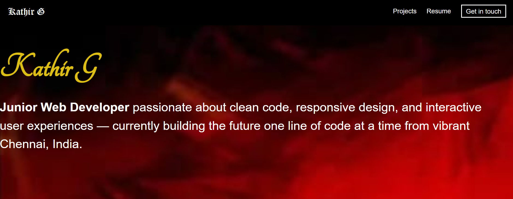

# 💼 Kathir G - Personal Portfolio Website

Welcome to the **Personal Portfolio Website** of **Kathir G**, a passionate Junior Web Developer and aspiring full-stack engineer from Chennai, India. This site showcases Kathir’s skills, projects, certifications, and coding profiles.

## 🌐 Live Demo

🚀 [View the Portfolio](https://github.com/Kathir2911/Portfolio_Kathir_G)  
*(Add your deployed GitHub Pages or Netlify/Vercel link here if available)*

---

## 📁 Project Structure

```
Portfolio_Kathir_G/
│
├── index.html          # Main HTML file (Home, About, Projects, Contact)
├── styles.css          # Styling using custom CSS & Google Fonts
├── script.js           # Smooth scroll + Back to Top functionality
├── images/             # Icons, background, profile image, logos
│
└── README.md           # 📄 You're reading it!
```

---

## 💡 Features

- 🎨 **Modern, clean design** with smooth scrolling
- 🧑‍💻 About section introducing the developer
- 🛠️ Skills section with icons (HTML, CSS, JS, Git, Python, SQL)
- 📁 Project showcase with responsive layout
- 📄 Resume access
- 🔗 Social and coding platform integration (LinkedIn, GitHub, LeetCode, etc.)
- 🔝 "Back to Top" button with smooth scroll

---

## 🛠️ Tech Stack

- **Frontend:** HTML5, CSS3, JavaScript (Vanilla)
- **Styling:** Custom CSS, Google Fonts, Font Awesome
- **Deployment:** GitHub Pages *(you can update this if hosted elsewhere)*

---

## 📸 Screenshots

| Home Page                            | About Me                             |
|-------------------------------------|--------------------------------------|
|  |  |

---

## 🚀 Getting Started

To run this project locally:

```bash
git clone https://github.com/Kathir2911/Portfolio_Kathir_G.git
cd Portfolio_Kathir_G
open index.html  # or use Live Server in VS Code
```

---

## 📬 Connect with Me

- 💼 [LinkedIn](https://www.linkedin.com/in/kathir-ganesan)
- 💻 [GitHub](https://github.com/Kathir2911)
- 📸 [Instagram](https://www.instagram.com/kathir_2911/)
- 🎯 [LeetCode](https://leetcode.com/u/Kathir_2911/)
- 🧠 [HackerRank](https://www.hackerrank.com/profile/Kathir2911)
- 🧾 [Microsoft Learn](https://learn.microsoft.com/en-us/users/kathir-2911/)
- 📊 [DataCamp](https://www.datacamp.com/portfolio/Kathir2911)

---

## 📝 License

This project is licensed under the [MIT License](LICENSE) - feel free to use and modify.

---

> © 2025 Kathir G — Building with passion from Chennai, India.
